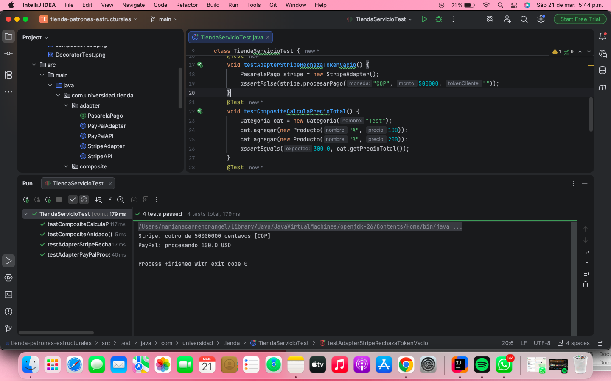
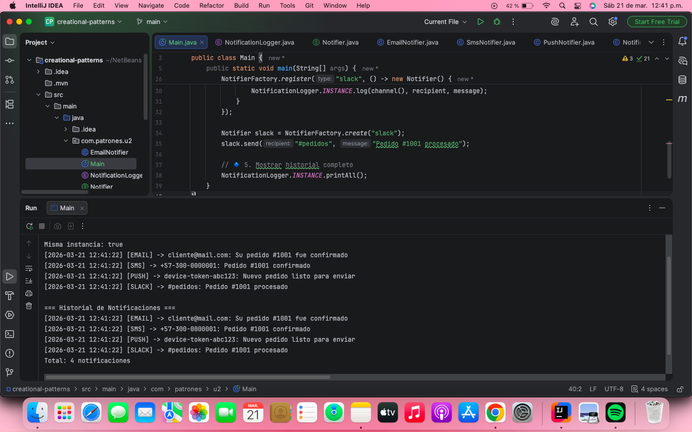

Tienda - Patrones Estructurales
📌 Descripción

Este proyecto implementa patrones de diseño estructurales en Java utilizando Spring Boot.
Se aplican los patrones Adapter, Composite en un contexto de tienda.

🧩 Patrones Implementados
🔹 Adapter

Permite integrar diferentes pasarelas de pago (PayPal, Stripe) bajo una misma interfaz.

🔹 Composite

Permite manejar productos individuales y categorías como una estructura jerárquica.

🧪 Pruebas

Se realizaron pruebas unitarias para validar el funcionamiento de los patrones.

📸 Evidencia de los 4 Test

📸 Evidencia Ejecucion

